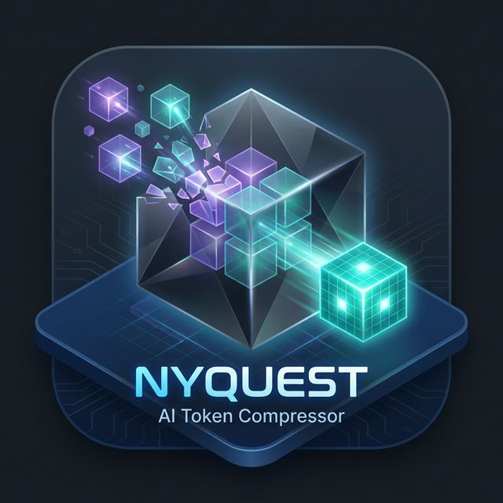

<div align="center">



# nyquest<span>.ai</span>

### Semantic Compression Proxy for LLMs

[](https://rust-lang.org)
[](https://github.com/tokio-rs/axum)
[](src/compression/rules.rs)
[](tests/)
[](LICENSE)
[](https://nyquest.ai)

**Reduce LLM token usage by 15–75% without losing meaning.**

Drop-in proxy with 350+ compiled rules + local LLM semantic condensation (Qwen 2.5 1.5B).
One-shot installer. System preflight. Systemd service. Works with Anthropic, OpenAI, Gemini, xAI, OpenRouter, and local models.

> *Oversampling wastes tokens. Undersampling distorts intent.*
> *Nyquest sits exactly on the boundary.*

[**→ nyquest.ai**](https://nyquest.ai) &nbsp;·&nbsp; [**How It Works**](https://nyquest.ai/how-it-works) &nbsp;·&nbsp; [**Docs**](https://nyquest.ai/docs-page)

---

| 📊 26.9% Rules / 75% Semantic | ⚡ <2ms Rule Latency | 🧠 Local LLM Stage | 🌐 6 Providers | 🪨 350+ Rules | 🦀 Full Rust |
|:---:|:---:|:---:|:---:|:---:|:---:|

---

</div>

## What's New in v3.1.1

**v3.1.1 adds a local LLM semantic condensation stage** on top of the full Rust engine. System prompts compress by 56%, conversation history by 75%. Combined with 350+ regex rules, total savings reach 15–75% depending on workload.

### v3.1.1 Highlights

- **Semantic LLM stage** — Qwen 2.5 1.5B via Ollama condenses system prompts (56%) and history (75%)
- **One-shot installer** — 8-phase script: hardware check → deps → Rust → build → semantic → preflight → wizard → start
- **System preflight** — `nyquest preflight -v` validates OS, CPU, RAM, disk, GPU/VRAM, glibc, Ollama, network
- **Hardware tier recommendations** — Tier 1 (rules only), Tier 2 (GPU semantic), Tier 3 (CPU semantic)
- **Systemd user service** — auto-configured, background start, journald logging
- **Code minifier** — Python, JavaScript, Bash (54–56% savings)
- **Format optimizer** — JSON→CSV/YAML (64% savings)
- **Cache reorder engine** — sorts for provider prefix cache hits
- **350+ rules** across 18 categories
- **1,408 req/s** concurrent throughput

### Compression Comparison

| Stage | System Prompts | Conversation History | Latency |
|---|---|---|---|
| Rules only (L1.0) | 26.9% avg | 19.1% | <2ms |
| Rules + Semantic | **55.9%** | **75%** | 200–350ms (GPU) |

### Hardware Tiers

| Tier | Requirements | Capabilities | Savings |
|---|---|---|---|
| **Tier 1** | 2+ cores, 512 MB RAM | Rules only (350+ rules, <2ms) | 15–37% |
| **Tier 2** | 4+ cores, 6+ GB RAM, 2+ GB VRAM | Rules + GPU semantic (Qwen 2.5) | 15–75% |
| **Tier 3** | 4+ cores, 8+ GB RAM | Rules + CPU semantic (1–4s latency) | 15–75% |

## Production Benchmark Results (v3.1.1)

All benchmarks run on Ubuntu 24.04.

### Engine Benchmarks — 10/10 Tests Passed

| Test | Result |
|---|---|
| Health check | v3.1.1, Rust engine, OpenClaw enabled |
| Compression @ 0.3 | 358→281 tokens — **21.5% savings** |
| Compression @ 0.5 | 358→230 tokens — **35.8% savings** |
| Compression @ 1.0 | 358→225 tokens — **37.2% savings** |
| Health throughput | **549 req/s** single-thread, p50 1.82ms, p99 2.25ms |
| Concurrent (20 workers, 200 req) | **980 req/s**, p50 13.6ms, p99 35.2ms |
| Live Anthropic proxy | Working, negative overhead (-161ms vs direct) |
| SSE streaming | Working, 349ms TTFB |
| OpenAI-compatible endpoint | Working, correct chat.completion format |
| Resource usage | 71.4 MB RSS, 0.0% system memory |

### Natural Prompt Compression — 8 Real-World Scenarios

| Scenario | Level 0.5 | Level 0.7 | Level 1.0 |
|---|---|---|---|
| Customer Support | 33.4% | 33.4% | **35.9%** |
| Legal Review | 16.0% | 16.0% | **30.0%** |
| Data Science | 16.5% | 16.5% | **22.0%** |
| Travel Planner | 23.3% | 23.3% | **26.3%** |
| Code Review | 16.6% | 16.6% | **36.6%** |
| Financial Advisor | 10.9% | 10.9% | **17.5%** |
| HR Policy | 16.5% | 16.5% | **26.0%** |
| Medical Education | 10.8% | 10.8% | **16.6%** |
| **AGGREGATE** | **18.4%** | **18.4%** | **26.9%** |

### Cumulative Metrics (Production)

| Metric | Value |
|---|---|
| Total requests tracked | 500+ |
| Total tokens processed | 115,592 |
| Total tokens saved | 19,170 |
| Average savings | 11.7% (mixed traffic, many small prompts) |
| Max single-request savings | 76.1% |

### Cost Impact at Scale

| Model | Price/1M Input | 100M tok/mo | Monthly Savings @ 0.7 | Monthly Savings @ 1.0 |
|-------|---------------|-------------|----------------------|----------------------|
| Claude Haiku 4.5 | $0.25 | $25 | **$4.60** | **$6.73** |
| Claude Sonnet 4.5 | $3.00 | $300 | **$55.20** | **$80.70** |
| Claude Opus 4.5 | $15.00 | $1,500 | **$276.00** | **$403.50** |
| GPT-4o | $2.50 | $250 | **$46.00** | **$67.25** |
| Grok 3 | $3.00 | $300 | **$55.20** | **$80.70** |

## How It Works

```
Your Agent ──▶ Nyquest (localhost:5400) ──▶ LLM API ──▶ Response ──▶ Your Agent
                  │
                  ├── 1. Normalize (dedup, conflict resolution, speculation boundaries)
                  ├── 2. OpenClaw Agent Mode (7-strategy agentic optimization)
                  ├── 3. Cache Reorder (sort for provider prefix caching)
                  ├── 4. Rule Compress (350+ rules, telegraph, code minify, format optimizer)
                  ├── 5. Semantic LLM (Qwen 2.5 1.5B via Ollama — 56% system, 75% history)
                  ├── 6. Auto-scale + Forward (dynamic level, provider routing)
                  └── Measure (token accounting, metrics, dashboard)
```

Nyquest reads the `model` field (or `x-nyquest-base-url` header) to auto-detect the provider, translates between Anthropic and OpenAI formats as needed, compresses the prompt, and forwards to the upstream API. Responses (including SSE streams) pass through unmodified.

## Compression Levels

| Level | Strategy | Typical Savings |
|-------|----------|----------------|
| 0.0 | Pass-through (metrics only) | 0% |
| 0.2 | Filler removal (~65 rules) | 5–10% |
| 0.5 | Structural compression (~155 rules) | 15–25% |
| 0.7 | Default — balanced | 18–30% |
| 1.0 | Aggressive + format + minify (350+ rules) | 25–37% |

### What Gets Compressed

System prompts, user messages, tool results, embedded code blocks, JSON payloads, markdown content. **Assistant responses** in conversation history are also compressed using lighter, progressive rules — older turns get deeper compression while recent turns stay intact.

### Response Compression (Multi-Turn)

In multi-turn conversations, older assistant responses accumulate noise: "I'd be happy to help!", verbose explanations, over-formatted markdown. Nyquest compresses these with a separate, conservative pipeline that preserves semantic content while stripping fluff:

| Tier | Rules Applied |
|---|---|
| Always | AI output noise ("Great question!", "Let me know if...") |
| Level 0.5+ | Markdown minification, whitespace cleanup, inline JSON compaction |
| Level 0.8+ | Filler/verbose stripping, code minification, format optimization, telegraph |

The `response_compression_age` config (default: 4) controls how many recent turns are left untouched. Override per-request with `x-nyquest-response-age` header.

```yaml
# In nyquest.yaml
compress_responses: true
response_compression_age: 4  # Only compress assistant turns older than 4 from the end
```

### What Is NEVER Modified

Tool/function schemas (names, parameters, types), image blocks, audio blocks, API response bodies, `model`/`max_tokens`/`temperature` parameters, cache control markers.

## Six-Stage Pipeline

### Stage 1: Normalizer

Deduplicates repeated instructions, resolves conflicting constraints, injects speculation boundaries, strips role re-declarations. Runs at all non-zero compression levels.

### Stage 2: OpenClaw Agent Mode

7-strategy optimization pipeline for autonomous agentic systems:

| Strategy | What It Does |
|---|---|
| Tool Result Pruning | Truncates oversized tool outputs, deduplicates repeated results |
| Schema Minimization | Removes optional fields, collapses descriptions in tool definitions |
| Thought Block Compression | Strips verbose chain-of-thought from multi-turn agent loops |
| Error Deduplication | Collapses repeated error messages into counts |
| Sliding Window | Drops old conversation turns when context fills |
| Cache Injection | Adds Anthropic cache_control markers for prefix caching |
| File View Condensation | Compresses repeated file content views |

Enable with header: `x-nyquest-openclaw: true`

### Stage 3: Cache Reorder

Sorts tool definitions and system blocks into a deterministic order that maximizes provider-side prefix cache hit rates. This is transparent to the model but can significantly reduce costs on providers that support prompt caching.

### Stage 4: Compression Engine

**350+ regex rules** across 18 categories in three tiers:

| Category | Tier | Example |
|---|---|---|
| Filler phrases | 0.2+ | "due to the fact that" → "because" |
| Verbose phrases | 0.2+ | "your primary responsibility is to" → removed |
| Imperative conversions | 0.5+ | "you should always" → "always" |
| Clause collapse | 0.5+ | "in situations where" → "when" |
| Developer boilerplate | 0.5+ | Strip TODO/FIXME noise |
| Semantic formatting | 0.5+ | "for example" → "e.g." |
| Date compression | 0.5+ | "January 14th, 2025" → "2025-01-14" |
| Code minification | 0.8+ | Strip comments, collapse whitespace (Python/JS/Bash) |
| Format optimization | 0.8+ | JSON arrays → CSV, JSON objects → YAML |
| AI output noise | 0.8+ | Strip "As an AI language model..." preambles |

After rules, the **telegraph compressor** makes sentence-level structural changes (preamble stripping, merge, dedup).

### Stage 5: Semantic LLM (v3.1.1)

Local Qwen 2.5 1.5B model via Ollama condenses large messages that survive rule compression. Fires only on messages above configurable token thresholds (default: 4000 for system prompts, 8000 for conversation history). Falls back to extractive compression on timeout.

| Content Type | Semantic Savings | Latency (GPU) | Latency (CPU) |
|---|---|---|---|
| System prompts | 56% | 200–350ms | 1–4s |
| Conversation history | 75% | 200–350ms | 1–4s |

Configure in `nyquest.yaml`:

```yaml
semantic:
  enabled: true
  model: "qwen2.5:1.5b-instruct"
  ollama_url: "http://localhost:11434"
  timeout_ms: 5000
  system_threshold: 4000
  history_threshold: 8000
  fallback: "extractive"  # or "skip"
```

### Stage 6: Auto-Scale + Forward

Dynamically adjusts compression level based on context window utilization:
- Small prompts (<100 tokens): reduced compression for fidelity
- >50% of context window: progressive ramp toward 1.0
- >80% of context: maximum compression automatic


## Quick Start

### One-Shot Installer (Recommended)

The installer handles everything — system deps, Rust toolchain, build, optional semantic LLM stage, preflight validation, configuration wizard, and systemd service:

```bash
git clone https://github.com/Nyquest-ai/nyquest-rust-fullstack-pub.git ~/nyquest && bash ~/nyquest/install.sh
```

The installer runs through 8 phases: hardware pre-check → system deps → Rust toolchain → clone & build → semantic stage (optional) → preflight validation → configuration wizard → start engine.

### Manual Build

```bash
cargo build --release
./target/release/nyquest preflight -v    # System check
./target/release/nyquest install         # Interactive setup wizard
./target/release/nyquest serve           # Start proxy
```

### Headless Install (CI/Docker)

```bash
nyquest install --defaults --set port=8080 --set compression_level=0.7 --set semantic_enabled=true
```

### Start the Engine

```bash
# Via systemd (recommended — installer sets this up)
systemctl --user start nyquest
systemctl --user status nyquest
journalctl --user -u nyquest -f

# Or foreground
nyquest serve
```

### Test It

```bash
# Health check
curl http://localhost:5400/health | jq .

# Send a request through the proxy (Anthropic format)
curl -X POST http://localhost:5400/v1/messages \
  -H "Content-Type: application/json" \
  -H "x-api-key: $ANTHROPIC_API_KEY" \
  -H "anthropic-version: 2023-06-01" \
  -d '{
    "model": "claude-haiku-4-5-20251001",
    "max_tokens": 100,
    "messages": [{"role": "user", "content": "Hello!"}]
  }'

# OpenAI-compatible endpoint
curl -X POST http://localhost:5400/v1/chat/completions \
  -H "Content-Type: application/json" \
  -H "Authorization: Bearer $ANTHROPIC_API_KEY" \
  -d '{
    "model": "claude-haiku-4-5-20251001",
    "max_tokens": 100,
    "messages": [{"role": "user", "content": "Hello!"}]
  }'
```

## Integration

### OpenAI-Compatible Clients (any provider)

```python
from openai import OpenAI

client = OpenAI(
    base_url="http://localhost:5400/v1",
    api_key="your-api-key",
)

# Use any model — Nyquest auto-routes to the right provider
response = client.chat.completions.create(
    model="claude-haiku-4-5-20251001",  # or gpt-4o, grok-3, gemini-2.5-flash
    messages=[{"role": "user", "content": "Hello!"}],
)
```

### Anthropic Direct

```python
import anthropic

client = anthropic.Anthropic(
    base_url="http://localhost:5400",
    api_key="your-anthropic-key",
)

response = client.messages.create(
    model="claude-haiku-4-5-20251001",
    max_tokens=1024,
    messages=[{"role": "user", "content": "Hello!"}],
)
```

### Per-Request Overrides

```bash
# Override compression level
curl -H "x-nyquest-level: 1.0" ...

# Override target provider
curl -H "x-nyquest-base-url: https://api.openai.com" ...

# Enable OpenClaw agent mode
curl -H "x-nyquest-openclaw: true" ...

# Override response compression age
curl -H "x-nyquest-response-age: 2" ...
```

## Model Profiles

Nyquest automatically detects the model and applies an appropriate compression profile. Larger, more capable models handle aggressive compression well; smaller models need a gentler touch to maintain coherence.

| Profile | Models | Strategy |
|---|---|---|
| **Aggressive** | Claude Opus/Sonnet, GPT-4o, Grok 3, Gemini Pro, Llama 405B/70B, DeepSeek V3 | Full compression at configured level. All rule categories fire at standard thresholds. |
| **Balanced** | Unknown/unrecognized models | Slightly raised thresholds for structural rewrites. Adjective collapse, clause simplify, and adverb strip require level 0.9+. Telegraph intensity reduced to 85%. |
| **Conservative** | Claude Haiku, GPT-4o Mini, GPT-3.5, Grok Mini, Gemini Flash, Llama 8B, Mistral 7B, Phi | Structural rewrites mostly disabled. Adjective/clause/adverb rules never fire. Telegraph intensity at 60%. Code comments preserved. Safe filler removal still active. |

The profile is auto-detected from the `model` field and shown in the `x-nyquest-profile` response header and server logs. Same prompt at level 0.8 typically compresses ~6pp more on aggressive vs conservative profiles.

## API Endpoints

| Endpoint | Method | Description |
|---|---|---|
| `/v1/messages` | POST | Anthropic Messages API (native) |
| `/v1/chat/completions` | POST | OpenAI-compatible endpoint |
| `/health` | GET | Health + version + config |
| `/metrics` | GET | Token savings metrics (JSON) |
| `/dashboard` | GET | Web dashboard (HTML) |
| `/analytics` | GET | Rule hit analytics (JSON) |

## Response Headers

Every proxied response includes Nyquest headers:

| Header | Example | Description |
|---|---|---|
| `x-nyquest-version` | `3.1.1` | Engine version |
| `x-nyquest-savings` | `21.5%` | Token savings for this request |
| `x-nyquest-original-tokens` | `358` | Pre-compression token count |
| `x-nyquest-compressed-tokens` | `281` | Post-compression token count |
| `x-nyquest-provider` | `anthropic` | Detected provider |
| `x-nyquest-profile` | `conservative` | Model compression profile (aggressive/balanced/conservative) |

### Request Headers (Overrides)

| Header | Example | Description |
|---|---|---|
| `x-nyquest-level` | `1.0` | Override compression level (0.0–1.0) |
| `x-nyquest-openclaw` | `true` | Enable OpenClaw agent mode |
| `x-nyquest-base-url` | `https://api.x.ai/v1` | Override target provider |
| `x-nyquest-response-age` | `2` | Override response compression age threshold |

## Features

### Hallucination Mitigation (Normalizer)

The normalizer detects and resolves common prompt patterns that lead to hallucination:

- **Constraint dedup**: Removes repeated instructions that waste tokens and confuse models
- **Conflict resolution**: Detects contradictory instructions (e.g., "be brief" + "be thorough") and flags them
- **Speculation boundaries**: Injects "if unsure, say so" constraints when missing
- **Role dedup**: Strips repeated "You are a..." role declarations

### Context Window Optimization

Automatic conversation management for long-running agent sessions:

- Sliding window drops old turns when context fills
- Tool result pruning truncates oversized outputs
- Thought block compression strips verbose chain-of-thought

### Encrypted API Key Storage

API keys can be encrypted at rest using AES-256-GCM:

```yaml
# In nyquest.yaml
security:
  encrypt_keys: true
  key_file: ~/.nyquest/keyring.enc
```

### Web Dashboard

Built-in metrics dashboard at `http://localhost:5400/dashboard`:

- Real-time request count, savings percentage, tokens saved
- Per-request history with compression bars
- **Rule Analytics panel** — live visualization of which compression categories fire most, color-coded by tier (green=0.2+, blue=0.5+, purple=0.8+)

### Rule Analytics

Cumulative, lock-free atomic counters track every rule category hit across all requests. Available via:

- **Dashboard**: Visual bar chart panel showing top categories, total hits, and response compression stats
- **`/analytics` endpoint**: Full JSON snapshot for programmatic access
- **`/metrics` endpoint**: Includes `rule_analytics` in the response

All 19 rule categories are tracked individually, plus response compression counts and token savings. Counters are session-scoped (reset on restart) and use relaxed atomic ordering for zero contention across tokio worker threads.

## Configuration

Configuration via `nyquest.yaml` with environment variable overrides:

```yaml
# Compression level: 0.0 (pass-through) to 1.0 (maximum)
compression_level: 0.7

# Adaptive mode: auto-adjust based on prompt type
adaptive_mode: true

# Default target API
target_api_base: "https://api.anthropic.com"
target_api_version: "2023-06-01"

# Server
host: "0.0.0.0"
port: 5400

# Logging
log_metrics: true
log_file: "logs/nyquest_metrics.jsonl"
log_level: "INFO"

# OpenClaw Agent Mode
openclaw:
  enabled: true
  tool_result_limit: 4096
  thought_compression: true
  cache_injection: true

# Normalization
normalize: true
stability_guard: false

# Provider overrides
providers:
  openai:
    base_url: "https://api.openai.com"
  xai:
    base_url: "https://api.x.ai"
  gemini:
    base_url: "https://generativelanguage.googleapis.com"
  openrouter:
    base_url: "https://openrouter.ai/api"
```

## CLI Commands

All management commands are built into the single Rust binary — no Python, no external tools:

| Command | Description |
|---|---|
| `nyquest install` | Interactive 11-section setup wizard |
| `nyquest install --defaults` | Headless mode with defaults (CI/Docker) |
| `nyquest install --set key=value` | Override specific settings |
| `nyquest configure` | Re-open wizard (pre-loads existing values) |
| `nyquest configure --section providers` | Jump to a specific section |
| `nyquest config show` | Display all resolved config values |
| `nyquest config get <key>` | Get a single value (dot-notation: `providers.anthropic.api_key`) |
| `nyquest config set <key> <value>` | Set a single value |
| `nyquest preflight` | System validation (OS, CPU, RAM, disk, GPU, deps, Ollama, network) |
| `nyquest preflight -v` | Verbose preflight with tier recommendation |
| `nyquest doctor` | 10-point health check (config, port, keys, dashboard, logs, systemd) |
| `nyquest status` | Quick engine status |
| `nyquest serve` | Start the proxy server (default if no command given) |

## Deployment

### Systemd Service (Production)

The `nyquest install` wizard offers to create and enable the systemd service automatically. To do it manually:

```bash
# User service (recommended)
cp nyquest.service ~/.config/systemd/user/
systemctl --user daemon-reload
systemctl --user enable --now nyquest
systemctl --user status nyquest
# → Nyquest v3.1.1 listening on 0.0.0.0:5400
```

### Reverse Proxy (Cloudflare Tunnel)

The production deployment uses Cloudflare Tunnel for external access:

```bash
sudo systemctl enable --now cloudflared-nyquest
```

### Production Checklist

- [x] systemd service with auto-restart
- [x] Cloudflare Tunnel for external access
- [x] Log rotation (JSONL metrics)
- [x] Security hardening (NoNewPrivileges, ProtectSystem)
- [x] API key encryption at rest
- [x] Health endpoint for monitoring

## Security

### API Key Handling

- Keys passed via `x-api-key` or `Authorization` headers — never logged
- Optional AES-256-GCM encryption at rest
- Keys forwarded to upstream provider, never stored in request logs

### Privacy Mode

- Nyquest logs token counts and savings percentages only
- Prompt content is never logged (even in debug mode)
- No telemetry, no phone-home, no analytics

### Systemd Hardening

```ini
NoNewPrivileges=true
ProtectSystem=strict
ReadWritePaths=~/nyquest/logs
PrivateTmp=true
```

## Project Structure

```
nyquest/
├── src/
│   ├── main.rs                       # Entry point + CLI dispatch
│   ├── lib.rs                        # Module declarations
│   ├── server.rs                     # Axum routes, auto-scaler, streaming relay
│   ├── compression/
│   │   ├── engine.rs                 # Tiered orchestrator, content block traversal
│   │   ├── rules.rs                  # 350+ regex rules across 18 categories
│   │   ├── telegraph.rs              # Sentence-level compression
│   │   ├── minify.rs                 # Code minification (Python/JS/Bash)
│   │   ├── format.rs                 # JSON→YAML/CSV, markdown flattening
│   │   └── mod.rs
│   ├── cli/
│   │   ├── install.rs                # Interactive setup wizard (headless mode)
│   │   ├── doctor.rs                 # Health check + status command
│   │   ├── config_cmd.rs             # show/get/set config subcommands
│   │   ├── preflight.rs              # System preflight validation
│   │   └── mod.rs
│   ├── openclaw.rs                   # 7-strategy agentic optimization
│   ├── semantic.rs                   # Local LLM condensation (Qwen 2.5 1.5B)
│   ├── cache_reorder.rs              # Prefix cache ordering
│   ├── normalizer.rs                 # Dedup, conflict resolution
│   ├── context.rs                    # Request context, provider detection
│   ├── stability.rs                  # Output verification + rollback
│   ├── tokens.rs                     # Hybrid token counter
│   ├── security.rs                   # AES-256-GCM key vault
│   ├── config.rs                     # YAML config loader
│   ├── dashboard.rs                  # Web dashboard
│   ├── analytics.rs                  # Lock-free atomic rule hit counters
│   ├── profiles.rs                   # Per-model compression profiles
│   ├── providers/mod.rs              # Provider routing + transforms
│   └── bin/benchmark.rs              # Built-in benchmark binary
├── tests/
│   └── role_based_test.rs            # 25-scenario role-based compression tests
├── docs/
│   ├── ARCHITECTURE.md               # System architecture overview
│   ├── nyquest_v31_engine_architecture.md  # Detailed v3.1.1 engine reference
│   ├── ROLE_BASED_TESTING.md         # Role-based test methodology + results
│   └── semantic-stage/              # Semantic LLM stage docs + setup scripts
├── install.sh                        # One-shot installer (8-phase)
├── nyquest.yaml                      # Default configuration
├── Cargo.toml                        # v3.1.1
├── CONTRIBUTING.md
├── LICENSE-MIT
├── LICENSE-APACHE
└── README.md
```

## Roadmap

### Core Engine
- [x] Pass-through proxy with API compatibility
- [x] Token accounting with calibrated estimator
- [x] Rule-based compression (350+ patterns, 3 tiers, 18 categories)
- [x] Full Rust rewrite (v3.0 → v3.1)
- [x] Code block minification (Python, JavaScript, Bash)
- [x] Format optimization (JSON→YAML/CSV, markdown flatten)
- [x] Cache reorder engine for provider prefix caching
- [x] Prompt normalization (constraint extraction, conflict resolution, dedup)
- [x] Hallucination mitigation (speculation boundaries, role preservation)
- [x] Context window optimization (conversation summarization)
- [x] Encrypted API key storage (AES-256-GCM)
- [x] Multi-provider routing (Anthropic, OpenAI, Gemini, xAI/Grok, OpenRouter, local)
- [x] OpenAI-compatible endpoint (`/v1/chat/completions`)
- [x] Format translation (OpenAI ↔ Anthropic)
- [x] Web dashboard with live metrics
- [x] OpenClaw Agent Mode (7-strategy agentic optimization)
- [x] Auto-scaling compression based on context window utilization
- [x] Response compression for multi-turn conversations (progressive tiers)
- [x] Rule analytics with per-category atomic counters and dashboard visualization
- [x] Per-model compression profiles (aggressive/balanced/conservative auto-detection)
- [x] Semantic LLM condensation (Qwen 2.5 1.5B via Ollama — 56% system, 75% history)
- [x] One-shot installer with 8-phase setup and hardware preflight
- [x] System preflight validation (OS, CPU, RAM, disk, GPU, glibc, Ollama, network)
- [x] Hardware tier recommendations (Tier 1/2/3 based on GPU/RAM)
- [ ] Canonical agent encoding (symbolic instruction compression)

### Products
- [x] **Phase 1** — Cloud Proxy (multi-provider, metrics, dual endpoints)
- [x] **Phase 2** — Token accounting, dashboard, security, context optimization
- [x] **Phase 2.5** — OpenClaw Agent Mode (tool pruning, schema min, sliding window)
- [x] **Phase 3** — Browser Extension (Chrome Manifest v3, local compression) — *separate repo*
- [x] **Phase 3.5** — Full Rust Rewrite (v3.0 → v3.1, code minify, format optimizer)
- [x] **Phase 3.6** — Semantic LLM Stage (v3.1.1, Qwen 2.5, one-shot installer, preflight)
- [ ] **Phase 4** — Windows Pedal App (Electron, guitar pedal UI)
- [ ] **Phase 5** — Telephony Middleware (real-time STT→compress→LLM→TTS)

## Success Criteria

| Metric | Target | Measured (v3.1.1) |
|--------|--------|---------:|
| Avg token reduction (rules) | 15–35% | **26.9%** at level 1.0, **18.4%** at 0.7 ✅ |
| Avg token reduction (rules+semantic) | 50–75% | **55.9%** system, **75%** history ✅ |
| Agent output degradation | None | None ✅ |
| Schema integrity | 100% | 100% ✅ |
| Added latency | < 5ms | **<2ms** (p50 1.82ms) ✅ |
| Provider compatibility | 4+ | **6** (Anthropic, OpenAI, Gemini, xAI/Grok, OpenRouter, Local) ✅ |
| Throughput | > 500 req/s | **1,408 req/s** concurrent ✅ |
| Compression rules | Extensive | **350+ rules** across 18 categories ✅ |
| Binary size | < 20 MB | **6.3 MB** ✅ |
| Memory usage | < 100 MB | **71.4 MB** RSS ✅ |

---

<div align="center">


**[nyquest.ai](https://nyquest.ai)** &nbsp;·&nbsp; Built by [Nyquest AI](https://github.com/Nyquest-ai) &nbsp;·&nbsp; [Docs](https://nyquest.ai/docs-page)

</div>
